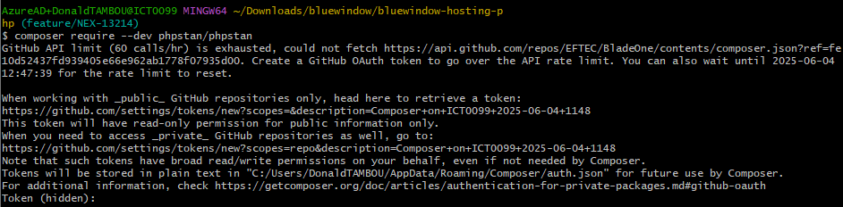
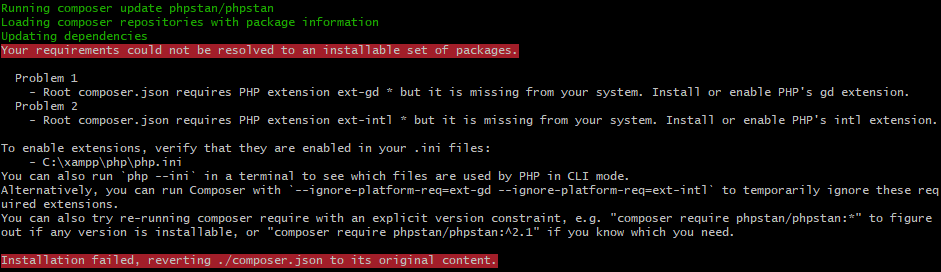
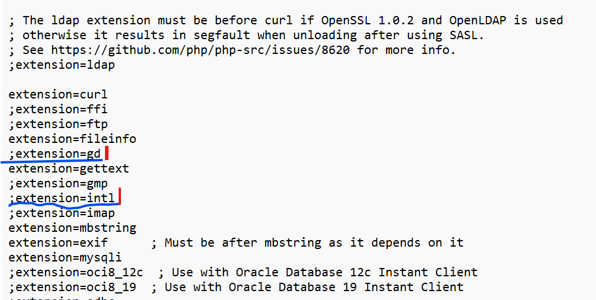
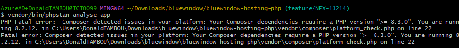

# Locally lunch a PHP analysis tool
This first version of the branch is to lunch locally analysis tool for PHP (PHPStan)
## Table of Contents
1. [Prerequisites](#prerequisites)
2. [Setup](#setup)
3. [Troubleshooting Potential Issues](#troubleshooting-potential-issues)

## Prerequisites

Before setting up this project, ensure that you have the following installed and configured:

* **PHP version >=8.3.0**: [Installation Guide](https://www.php.net/downloads.php)
* **Composer**: [Installation Guide](https://getcomposer.org/download/)

## Setup
### GitHub Setup
Clone this repo an switch to the right branch.
```bash
git clone https://github.com/bw-gaming/bluewindow-hosting-php.git
cd bluewindow-hosting-php
git checkout feature/NEX-13214
```
### Setup the script
Add execution mode the file
```bash
chmod +x analyze_with_phpstan.sh
```
## Start to analyze applications (folders)
Start to analyze folders with passing them when executing the script
```bash
./analyze_with_phpstan.sh folder1 folder2 folder3 etc
```
replace `folder1`, `folder1`, ..... with your own folders's names


## Troubleshooting Potential Issues

Here are some common issues you might encounter and tips for debugging:
    * **OAuth Composer -> GitHub**
        
    To solves this, create a new classic token on GitHub, call it as you want, maybe `Composer token` and **lives all scopes unselected** then create the token. Store it somewhere, paste it where we are asking you token in the previous screen
    * **Require somes extensions**
        
    To solves this, first stop the apache server, open the php init file located in `C:xampp\php\php.ini` and then search for the both lines aboves
         
    Uncomment the both lines by delete the `;` at the begin, save it and start the apache server and start again to analyze your folders
    * **PHP version**
        
    If you encountered this issue, Just upgrade your version of PHP to the version require
